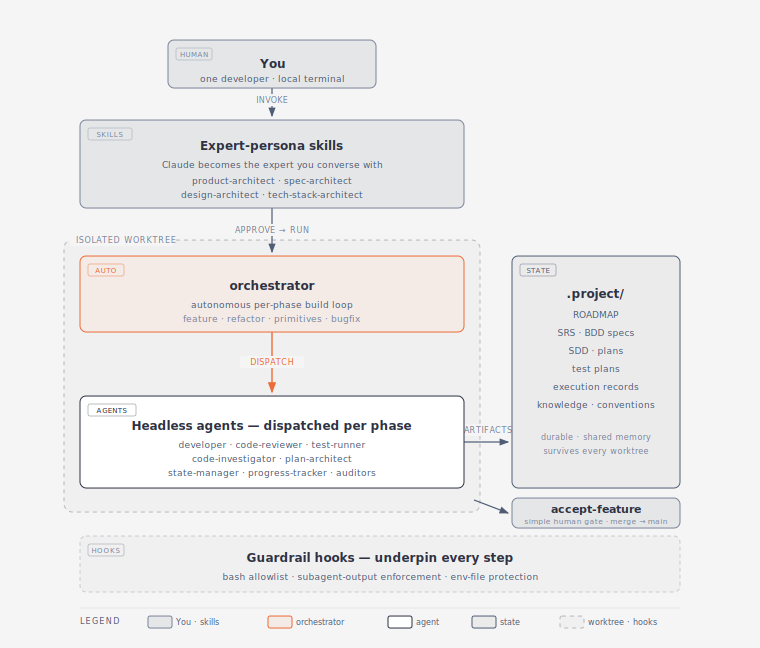

# Architecture

This is the under-the-hood companion to the [README](README.md). It explains how the pipeline is put together — the core abstractions, why they exist, and the mechanisms that make a fleet of LLM agents behave predictably enough to ship real code.



The diagram shows the system as a **stack**. At the top is **you** and the **expert-persona skills** you invoke — the human side that owns intent and approval. Below them sits the **orchestrator**, the autonomous core, which dispatches a cast of **headless agents** one phase at a time. To the side is the shared **`.project/` state** every agent reads from and writes to. When a feature is finished, the simple **`accept-feature`** gate merges it to `main` — the one human action that promotes work out of the worktree. The orchestrator and its agents run against an **isolated git worktree**, and a layer of **guardrail hooks** underpins every step. The rest of this document walks through each piece.

## Two primitives: skills and agents

The whole system is built from just two kinds of component, with a deliberate split of responsibility.

### Skills

**Skills are packaged playbooks of instructions.** They divide by *who* runs them — and, for one group, running a skill changes who you're talking to.

**User-invocable skills** can only be started by a *human*; they're marked `disable-model-invocation`, so the model can never call them itself. Most are **persona skills** — running one takes over the session and turns Claude into a role it holds for the whole session — and they split into two kinds. A third, thinner group adopts no persona at all:

- **Expert personas.** Running one **turns Claude into a domain expert you converse with**: `/product-architect` becomes a product strategist, `/spec-architect` a requirements engineer, `/design-architect` a software designer, `/tech-stack-architect` a stack advisor. The expert interviews you, holds the whole conversation, and co-authors the artifact — you're talking to a specialist in the field, not filling in a form.
- **The orchestrator.** `/orchestrator` is a persona too, but a coordinator rather than a conversationalist. Claude becomes the build driver: it takes over the session, dispatches agents phase by phase, routes their results, and pauses for your go-ahead at each gate. Like the experts it holds a role for the whole session — it simply *drives* the build instead of interviewing you.
- **Simple action skills.** `/accept-feature` and `/abandon-feature` are one-shot commands, not personas. Claude doesn't *become* anything and doesn't interview you: each performs a single, deliberate action behind a human go-ahead — `accept-feature` merges a finished feature into `main`; `abandon-feature` closes one out. They're kept deliberately thin precisely because the action they take is irreversible and must stay in human hands.

All are human-facing — they own intent and approval, and in the diagram they make up "the human side."

**Machinery skills**, by contrast, are loaded by the model or a sub-agent *itself*, mid-task, with no human typing. They come in two flavors: **model-invoked** skills, pulled in when a task needs one (`find-subagent-contract` before dispatching a sub-agent, `commit-to-git` at a commit step), and **reference** skills, read on demand as just-in-time guidance (`bash-usage`, `create-folder`, `context-curation`, `use-pipeline-scripts`). None are preloaded — an agent reaches for one only at the step that needs it. Because they're shared procedures, the same logic (how to commit, how to locate a contract, how to write a convention doc) lives in one place instead of being copy-pasted into every prompt.

### Agents

**Agents are the headless sub-agents the pipeline dispatches to do focused work in the background.** Each receives a precise task, executes it in an isolated context, writes a persistent artifact, and reports back. Agents own execution.

Keeping the human-facing skills separate from the background agents is what lets the pipeline run long automated stretches without losing the human in the loop — control returns to you only at a user-invocable-skill gate, where an expert persona picks the conversation back up, or where a simple gate like `accept-feature` asks for the one approval that matters. Loading machinery skills only at the step that needs them is the **progressive-disclosure** principle — see [Progressive context loading](#progressive-context-loading--fractal-documentation) below.

## The semi-autonomous spine

```
product-architect → tech-stack-architect → spec-architect → design-architect
        │                                                          │
        └────────────────────────  approvals  ─────────────────────┘
                                       │
                                  orchestrator        (runs autonomously
                                       │               inside a git worktree)
                            developer → code-reviewer → test-runner → code-investigator
                                       │
                                 accept-feature        (simple human gate: merge to main)
```

Everything to the left of `orchestrator` is human-driven, one approved command at a time. `orchestrator` is the autonomous core — it runs the per-phase build loop on its own. `accept-feature` is the final human gate, a deliberately simple skill whose only job is to merge finished work to `main`. The guiding rule behind the whole split: **autonomy is applied where work is cheap and reversible; human judgment is required wherever an action is irreversible** — merging to `main`, or abandoning a feature.

## Interface contracts: typed handoffs between agents

Every agent has a contract in [`agents/interface-contracts/`](agents/interface-contracts) that declares exactly what it consumes and what it emits. **Callers depend on the contract, not on the agent's internals** — Claude and its sub-agents read the relevant contract before dispatching an agent. This is ordinary service-boundary discipline applied to agents: an agent can be rewritten freely as long as its contract holds, and the orchestrator can route between agents purely on contract shape. 22 contracts keep the ~17-agent cast composable.

## The dual-output protocol and its enforcement

Pipeline agents produce **two** things: a persistent **artifact file** (a review report, a plan, an investigation, a phase summary) that downstream agents read, and a short **conversational summary** for the orchestrator. The artifact is the real product — the orchestrator routes on it.

The classic failure mode is an agent that finishes its analysis, returns a chatty summary, and *forgets to write the file* — silently breaking the next stage. Two layers in [`hooks/enforce-subagent-output.sh`](hooks/enforce-subagent-output.sh) make that impossible:

1. **Registry enforcement.** A registry lists every agent type that must produce a file. On `SubagentStop`, if a registered agent tries to stop without declaring an output path, the hook blocks the return with instructions.
2. **Manifest verification.** Once the agent declares its target path, the hook verifies the file actually exists there before allowing the stop.

A bounded safety valve releases the agent after repeated blocks, so a genuinely stuck agent can't loop forever. The result: pipeline-critical artifacts are *guaranteed* to exist, not merely requested politely in a prompt.

## Guardrails

- **Bash allowlist** ([`hooks/validate-bash-command.sh`](hooks/validate-bash-command.sh)) — a `PreToolUse` hook that permits only known-safe command prefixes and blocks everything else with a helpful message. Defense-in-depth against an agent running something destructive.
- **Env-file protection** ([`hooks/protect-env-files.sh`](hooks/protect-env-files.sh)) — prevents reads and writes of sensitive environment files.
- **Worktree isolation** — automated build, test, and review all happen in a throwaway git worktree; the real branch is never mutated by automation, only by the human-approved `accept-feature` merge.

## The orchestrator's build loop

For each phase, `orchestrator` runs the same loop: **developer** writes the code → **code-reviewer** checks it → tests are written and run → failures go to **code-investigator** for root-cause analysis. It tracks escalation counters so retries are bounded, applies diagnostic and investigation routing to pick the right recovery path, and stops to ask you when a problem exceeds what it can safely fix on its own. See [`skills/orchestrator/`](skills/orchestrator) for the loop, the counters, and the recovery paths.

## Project state model: the `.project/` convention

Projects driven by this pipeline keep their durable, LLM-agnostic state in a `.project/` directory at the repo root, organized into four stable sectors:

| Sector | Holds |
|---|---|
| `product/` | direction + release history: vision, PRD, roadmap, cycle tracking, release archives |
| `knowledge/` | stable engineering knowledge: architecture, backend/frontend overviews, domain, conventions |
| `cycles/` | per-cycle work: specs, plans, execution records, codemods |
| `pipeline/` | the AI-process machinery: quality reports, cleanup proposals, committed tooling |

A single agent — `progress-tracker` — owns the roadmap and every lifecycle transition; all other agents delegate roadmap writes to it. Centralizing ownership of mutable shared state avoids the write-conflict chaos you'd otherwise get from many agents editing the same files.

## Progressive context loading & fractal documentation

Agents and skills don't carry one giant prompt. Each loads `modes/`, `steps/`, and `essentials/` files on demand, selected by the task — so an invocation only ever holds the context it needs. Documentation follows the same **fractal** principle: directories carry their own guidance, and a reader (human or agent) consults the nearest doc before falling back to the root. [`documentation/`](documentation) holds a guide per agent and skill plus the rendered architecture diagrams.
