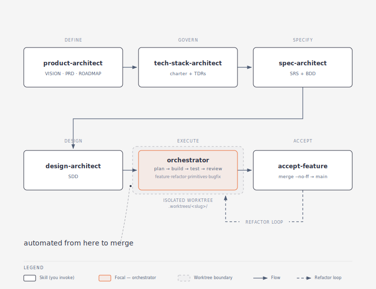

# Semi-Autonomous Agentic Development Pipeline

[](LICENSE)
[](https://docs.anthropic.com/en/docs/claude-code)
[]()

**A semi-autonomous, multi-agent software-development pipeline for [Claude Code](https://docs.anthropic.com/en/docs/claude-code) — from a software idea to finished, reviewed, merged code, with you in control at every checkpoint.**

---

## What Is It?

The **Semi-Autonomous Agentic Development Pipeline** is a structured, multi-agent software-development system that runs entirely inside [Claude Code](https://docs.anthropic.com/en/docs/claude-code). It takes a software idea through every stage a real engineering team would run — product definition, technology selection, requirements, design, implementation, testing, and review — and turns it into finished, reviewed, merged code. You run a handful of commands to say *what* you want; behind each one, specialised AI helpers do the detailed work and stop to ask for your approval at every gate.

It is built for **one developer working locally**. There is no Jira, no Slack, no external ticket queue: the backlog, the "tickets," and the hand-offs between steps all live as plain files inside your repository (under a `.project/` directory), and you drive the whole thing from your terminal.

The system is assembled from two primitives:

- **Skills** are the commands you invoke — and the ones you'll use *become* the expert you talk to. Run `/spec-architect` and Claude turns into a requirements engineer that interviews you and co-writes the spec, rather than just running a form. (A handful of skills are instead quiet machinery that the agents call for themselves, mid-task — you never invoke those.)
- **Agents** are the headless sub-agents the pipeline runs *for* you in the background. They receive a precise task, execute it in an isolated context, write a persistent artifact, and report back. Each agent has an **interface contract** — a typed declaration of what it consumes and produces — that Claude and its sub-agents consult whenever they need to interact with that agent (see [How It Works](#how-it-works) and [Documentation](#documentation)).

Everything automated happens in a disposable copy of your project (a git **worktree**), so your `main` branch is never touched until you approve the final merge.

> **User-level by design, project-level when you need it.** The pipeline is meant to be installed **once at your user level** (`~/.claude`), so its agents, skills, and hooks are available in every project you open with Claude Code. It can equally be **scoped to a single project** by vendoring it into that repo's `.claude/` directory. Both modes produce an identical `.claude/` layout, so every internal reference resolves the same way either way — see [Installation](#installation).

---

## Table of Contents

- [What Is It?](#what-is-it)
- [Installation](#installation)
- [Dependencies](#dependencies)
- [Getting Started](#getting-started)
  - [The golden rule: one skill per chat](#the-golden-rule-one-skill-per-chat)
  - [The sequence](#the-sequence)
  - [Scope, ordering, and parallelism](#scope-ordering-and-parallelism)
  - [How freely the orchestrator runs](#how-freely-the-orchestrator-runs)
- [How It Works](#how-it-works)
  - [From idea to merged code](#from-idea-to-merged-code)
  - [The per-phase build loop](#the-per-phase-build-loop)
  - [The cast of agents](#the-cast-of-agents)
  - [Interface contracts](#interface-contracts)
  - [The pipeline turned on itself](#the-pipeline-turned-on-itself)
- [Repository Layout](#repository-layout)
- [Documentation](#documentation)
- [FAQ](#faq)
- [License](#license)

---

## Installation

The pipeline installs into your **user-level** Claude Code config (the intended default) or into a **single project** — pick a level when you run the installer.

**User-level** (recommended — applies the pipeline to every project). Clone to a throwaway directory, then merge into `~/.claude`:

```bash
git clone https://github.com/Shultz12/semi-autonomous-agentic-dev-pipeline.git /tmp/pipeline
bash /tmp/pipeline/install.sh --user   # merges into ~/.claude
```

**Project-level** (scopes the pipeline to one repo). From the project root:

```bash
git clone https://github.com/Shultz12/semi-autonomous-agentic-dev-pipeline.git .claude
bash .claude/install.sh --project   # merges in the hooks, gitignores .claude/
```

The installer is **additive**: it merges three hooks into the target `settings.json` and never overwrites or deletes anything you already have. ⚠️ It **stops with an alert** if it finds existing `agents/` or `skills/` directories that could collide. **Recommended: install into a `.claude/` that has no `agents/` or `skills/` of your own**, so the pipeline's files can't clash with or be shadowed by yours. Update later with `git -C <pipeline-dir> pull` (then re-run `install.sh` for a user-level install).

See **[INSTALL.md](INSTALL.md)** for the rest — the collision guard, the `origin/main` requirement, updating, opting out of the gitignore, and uninstalling.

---

## Dependencies

The pipeline's only hard requirements are the tools it shells out to.

| Dependency | Required | Purpose |
|---|---|---|
| **[Claude Code](https://docs.anthropic.com/en/docs/claude-code)** | ✅ | The host environment the whole pipeline runs in. |
| **git** | ✅ | Used to clone the pipeline and (in the orchestrator) to manage the isolated worktrees. |
| **bash** | ✅ | `install.sh` is a POSIX `sh` script; **Git Bash** works on Windows. |
| **jq** *or* **python3** | Recommended | Used to merge the hooks into your `settings.json` cleanly. Without either, the installer prints the hook block for you to paste by hand — it never corrupts an existing `settings.json`. |

**Project requirement.** The project you build in must be a **git repository with an `origin` remote and a `main` branch** — the orchestrator spins up each feature's worktree from `origin/main`. See [The `origin/main` requirement](INSTALL.md#the-originmain-requirement) in INSTALL.md.

**Model requirement.** Run the skills you drive yourself on **Opus 4.8** with reasoning effort **`xhigh`**. Each is a long, stateful interview or build driver, and the extra reasoning is what keeps the spec, design, and build coherent.

---

## Getting Started

Every command below is a skill you invoke from a Claude Code chat.

### The golden rule: one skill per chat

**Run each major skill in its own, fresh chat.** Each is a long-running, stateful session that piles up context — an interview that co-writes a document, or the orchestrator driving a whole build. Sharing a chat between skills lets an earlier step's context bleed into the next and degrade its output ("context rot"). Start a new chat each time you move to the next skill:

- `/product-architect`, `/tech-stack-architect`, `/spec-architect`, `/design-architect`, and `/orchestrator` should **each be run in a new chat**.
- For `/orchestrator` specifically, also **start a new chat after every phase** to avoid context bloat. The orchestrator persists its state to disk, so a fresh chat resumes exactly where it left off — run `/orchestrator <feature> resume` to pick up the next phase.

### The sequence

The skills run **sequentially** — finish one and approve its output before starting the next.

1. **`/product-architect`** — define the product: vision, PRD, and the ROADMAP that every later step reads. *One-time, per project.*
2. **`/tech-stack-architect`** — choose the approved technology stack features are allowed to build on. *One-time, per project.* (May span several chats — see below.)
3. **`/spec-architect <feature>`** — write the spec (SRS + BDD) for **one** feature. *Per feature.*
4. **`/design-architect <feature>`** — design how to build that feature (SDD). *Per feature.*
5. **`/orchestrator <feature>`** — build, test, and review it, phase by phase. *Per feature.*
6. **`/accept-feature <feature>`** — merge the finished work into `main`, only once you approve it.

Each step waits for your approval before the next begins. A few more skills you invoke directly when needed: **`/abandon-feature`** to close out a build you're dropping, and **`/agent-architect`** and **`/domain-architect`** to extend the pipeline itself. Run these in their own chats too.

### Scope, ordering, and parallelism

Two skills are **project-wide** (run once for the whole project); three are **feature-wide** (run once per feature).

| Skill | Scope | Run order | Parallelism |
|---|---|---|---|
| `/product-architect` | **Project-wide** | First. One-time. | Single chat. |
| `/tech-stack-architect` | **Project-wide** | After `product-architect` is finished. One-time. | May span **multiple chats** (see below). |
| `/spec-architect <feature>` | **Feature-wide** | Per feature, before its design. | One chat per feature; **features can run in parallel**. |
| `/design-architect <feature>` | **Feature-wide** | Per feature, after that feature's spec. | One chat per feature; **features can run in parallel**. |
| `/orchestrator <feature>` | **Feature-wide** | Per feature, after that feature's design. | One chat per feature; **features can run in parallel** — phases within a feature stay sequential. |

**Project-wide skills are strictly sequential.** You must finish working with `/product-architect` and approve its output *before* you activate `/tech-stack-architect`. The stack selection depends on the product the first step defined.

**`/tech-stack-architect` may need more than one chat.** It does heavier research and retrieval (RAG), so its context fills faster than the others'. After roughly **100k–150k tokens**, ask the tech-stack-architect to **persist the work it has done so far** (it writes the stack charter and decision records to disk), then **start a new chat** and call `/tech-stack-architect` again to continue from where it left off.

**Feature-wide skills can run in parallel across features.** Within a single feature, `spec-architect → design-architect → orchestrator` must run in order. But you can work on **multiple features at the same time** by opening one chat per feature — e.g. two orchestrators driving two different features concurrently. Each `/orchestrator` builds in its **own git worktree**, so parallel features never collide. Within any one feature, the orchestrator's phases always run sequentially.

### How freely the orchestrator runs

Once a build is under way, how often the orchestrator pauses for you is governed by **Claude Code's permission mode**, not by the pipeline itself. Running Claude Code in **auto-accept ("auto") mode** lets the orchestrator operate freely — it dispatches agents, writes code, and drives the test loop without stopping to confirm each action — the most hands-off way to take a feature to completion.

You don't have to begin there. **On your first builds, consider leaving auto mode off** and approving each action as it happens, so you can see exactly what the orchestrator is doing and build trust in the loop before you let it run unattended.

Whichever mode you choose, the **bash-allowlist guardrail hook** (`validate-bash-command.sh`) stays in force: it permits only known-safe commands and blocks anything outside the allowlist, so even a freely running orchestrator can't reach for an operation you haven't sanctioned. Tighten that allowlist when you want a shorter leash, and widen it as your confidence grows. See [Guardrails](ARCHITECTURE.md#guardrails) for the full set.

---

## How It Works

The whole system is built from two kinds of component, with a deliberate split of responsibility. **Skills** are packaged playbooks of instructions; the user-invocable ones mostly take over the session as a persona — an expert architect you converse with, or the orchestrator that drives the build — while a thin set of action skills (`accept-feature`, `abandon-feature`) and *machinery* skills (loaded by the model or a sub-agent itself, mid-task) play no persona at all. **Agents** are the headless sub-agents the orchestrator dispatches to do focused work in the background. Keeping the human-facing skills separate from the background agents is what lets the pipeline run long automated stretches without losing the human in the loop. For the full design — the primitives, the dual-output protocol, the state model, and the guardrails — see **[ARCHITECTURE.md](ARCHITECTURE.md)**.

### From idea to merged code



Each box is a command, and underneath it the artifact that command produces:

- **`product-architect`** — your vision, PRD, and the **ROADMAP**, the backlog every later step reads.
- **`tech-stack-architect`** — the approved-technology list that features are allowed to build on.
- **`spec-architect`** — the **SRS** (user stories and their acceptance criteria) and the **BDD** scenarios for one feature.
- **`design-architect`** — the **SDD**: the architectural decisions for *how* to build that feature.
- **`orchestrator`** — takes the spec and design and builds the feature on its own, inside the dashed *worktree* (a throwaway copy of your repo).
- **`accept-feature`** — merges the finished work into `main`, only once you approve it.

The first four boxes are commands you run and approve one at a time; from `orchestrator` to the merge, everything is automatic. The documents flow downstream in one direction: the SRS and BDD pin down *what* to build, the SDD decides *how*, the plan breaks it into phases, and each phase's test plan checks the result back against the original BDD scenarios.

### The per-phase build loop


The orchestrator does not build a feature in one shot. It splits the work into small **phases** — each a single-layer slice (a handful of related backend, frontend, infrastructure, or test tasks) — and runs every phase through the same loop. You never write phases by hand: `plan-architect` derives them from the spec and design into an implementation plan you approve before the build begins. For each phase the orchestrator hands a *fresh* `developer` exactly what it needs and nothing else, and **pauses for your go-ahead at the end of every phase** (the natural point to start a new chat and `resume`).

The orange "everything passed" path advances to the next phase; dashed arrows are automatic retries, each capped so the loop can't spin forever. If a problem can't be fixed automatically, the loop stops and asks you.

### The cast of agents

The commands above are the parts you touch. Underneath, the orchestrator dispatches a small cast of headless agents, each with one job:

- **`plan-architect`** — turns the SRS, BDD, and SDD into a phased implementation plan; later writes each phase's test plan from the BDD scenarios and the code just built.
- **`plan-auditor` / `spec-auditor` / `design-auditor`** — validate the plan, spec, and design before anything downstream consumes them, sending them back for revision when they fall short.
- **`developer`** — implements one phase's tasks for its layer, or writes that phase's tests.
- **`code-reviewer`** — reviews each phase's code (and its tests) for correctness, integration, and convention gaps.
- **`test-runner`** — runs the test suite and labels each failure as a code bug or a test bug.
- **`code-investigator`** — does root-cause analysis on failures and grades how far the fix must reach.
- **`state-manager`** — distils each finished phase into a summary and a handoff, so the next phase starts with just the context it needs.
- **`progress-tracker`** — the single owner of the ROADMAP and the per-feature tracking files; every other agent asks it to record status changes, so the shared state never has two writers.

The pipeline ships further agents for refactor and release work — `pattern-analyst`, `pattern-analyst-auditor`, `knowledge-curator`, `quality-analyst`, and `milestone-archivist` — covered in their guides under [`documentation/`](documentation).

### Interface contracts

Every agent has a contract in [`agents/interface-contracts/`](agents/interface-contracts) that declares exactly what it consumes and what it produces. **Callers depend on the contract, not on the agent's internals** — Claude and its sub-agents read the relevant contract before dispatching an agent, so an agent can be rewritten freely as long as its contract holds, and the orchestrator can route between agents purely on contract shape. See the [contract index](agents/interface-contracts/_index.md).

### The pipeline turned on itself

Every agent and skill belongs to a **knowledge domain** that supplies its conventions, patterns, and templates. One of those domains — **Agent Tooling** — is the pipeline applied to itself: its only job is building and maintaining the agents and skills the pipeline runs on. **`agent-architect`** designs, creates, and updates those agents, skills, and hooks (and writes each agent's interface contract); **`agent-auditor`** reviews those definitions against a standards checklist; and **`domain-architect`** curates the shared pattern libraries the architect draws from. The same specify → build → review discipline the pipeline applies to your product, it applies to itself.

---

## Repository Layout

```
.
├── agents/                     # Headless sub-agent definitions
│   └── interface-contracts/    # Typed input/output contract per agent (+ _index.md)
├── skills/                     # User-invocable skills + machinery skills
├── hooks/                      # Guardrail hooks (bash allowlist, env protection, output enforcement)
├── documentation/             # In-depth guide per agent & skill + rendered diagrams
│   └── diagrams/               # Architecture, pipeline, and phase-loop SVGs
├── install.sh                  # Additive installer (--user | --project)
├── settings.template.json      # Reference hook block for both install levels
├── INSTALL.md                  # Full installation, update, and uninstall guide
├── ARCHITECTURE.md             # System design and mechanisms
└── README.md                   # You are here
```

Projects driven by the pipeline keep their durable, LLM-agnostic state in a **`.project/`** directory at the repo root, organized into four stable sectors:

| Sector | Holds |
|---|---|
| `product/` | direction + release history: vision, PRD, roadmap, cycle tracking, release archives |
| `knowledge/` | stable engineering knowledge: architecture, backend/frontend overviews, domain, conventions |
| `cycles/` | per-cycle work: specs, plans, execution records, codemods |
| `pipeline/` | the AI-process machinery: quality reports, cleanup proposals, committed tooling |

---

## Documentation

There is a more in-depth guide for **every agent and skill** in the [`documentation/`](documentation) directory — start there when you want the detail behind any command:

| Document | What it covers |
|---|---|
| [ARCHITECTURE.md](ARCHITECTURE.md) | The primitives, dual-output protocol, state model, and guardrails |
| [INSTALL.md](INSTALL.md) | User vs project install, hooks, `origin/main`, updating, uninstalling |
| [`documentation/`](documentation) | A `*.guide.md` per agent and skill (e.g. `orchestrator.guide.md`, `spec-architect.guide.md`) |
| [`documentation/diagrams/`](documentation/diagrams) | Rendered architecture, pipeline, phase-loop, and lifecycle diagrams |
| [`agents/interface-contracts/`](agents/interface-contracts) | The typed input/output contract for every agent, plus an [index](agents/interface-contracts/_index.md) |

Each agent's **interface contract** is the reference Claude and its sub-agents consult whenever they need to interact with that agent — read the relevant contract before dispatching an agent, and the [guide](documentation) when you want the full picture.

---

## FAQ

<details>
<summary><strong>Why run each skill in its own chat?</strong></summary>

Each major skill is a long, stateful session — an interview that co-writes a document, or the orchestrator driving a whole build. Sharing a chat lets an earlier step's context bleed into the next and degrade its output ("context rot"). One skill per fresh chat keeps each step's context clean.

</details>

<details>
<summary><strong>Why start a new chat after every orchestrator phase?</strong></summary>

A single orchestrator run can accumulate a lot of context across phases. The orchestrator persists its state to disk after each phase, so you lose nothing by starting fresh — open a new chat and run `/orchestrator <feature> resume` to continue with a lean context.

</details>

<details>
<summary><strong>Do I have to follow the skills in order?</strong></summary>

Yes. The flow is sequential: `product-architect → tech-stack-architect → spec-architect → design-architect → orchestrator → accept-feature`. Each step's output feeds the next. In particular, finish `/product-architect` before starting `/tech-stack-architect` — stack selection depends on the product the first step defines.

</details>

<details>
<summary><strong>My tech-stack step is filling up its context — what do I do?</strong></summary>

`/tech-stack-architect` does heavier research and retrieval, so it fills context faster than the others. After roughly **100k–150k tokens**, ask it to **persist the work done so far** (it writes the stack charter and decision records to disk), then **start a new chat** and call `/tech-stack-architect` again to continue.

</details>

<details>
<summary><strong>Can I work on more than one feature at a time?</strong></summary>

Yes. `spec-architect`, `design-architect`, and `orchestrator` are **feature-wide**, so you can run them in parallel across features — one chat per feature. Each `/orchestrator` builds in its **own git worktree**, so parallel features never collide. Within a single feature, run the three in order, and the orchestrator's phases always run sequentially.

</details>

<details>
<summary><strong>Should I install at user level or project level?</strong></summary>

The pipeline is **designed to be user-level** (`~/.claude`), so it's available in every project. Install it at the project level only when you want to scope it to one repo — both modes produce an identical layout. See [Installation](#installation) and [INSTALL.md](INSTALL.md).

</details>

<details>
<summary><strong>Does the pipeline touch my <code>main</code> branch?</strong></summary>

Not until you approve. All automated build, test, and review work happens in a disposable git **worktree** created from `origin/main`. Finished work only reaches `main` through `/accept-feature`, after your explicit approval.

</details>

<details>
<summary><strong>What are interface contracts, and do I need to read them?</strong></summary>

Each agent has a contract in [`agents/interface-contracts/`](agents/interface-contracts) declaring exactly what it consumes and produces. They're what Claude and its sub-agents consult to interact with an agent — you don't normally need to read them, but they're the place to look when extending the pipeline or debugging a handoff.

</details>

<details>
<summary><strong>Which model and reasoning effort should I use?</strong></summary>

Run the skills you drive yourself on **Opus 4.8** with reasoning effort **`xhigh`**. Each is a long, stateful interview or build driver, and the extra reasoning is what keeps the spec, design, and build coherent.

</details>

---

## License

[PolyForm Noncommercial License 1.0.0](LICENSE) — © 2026 Yarden Shultz.
